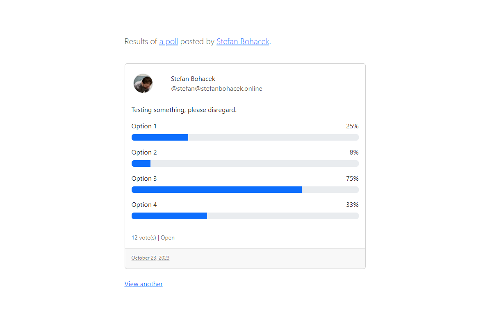

# Fediverse Poll Results Viewer



A proof-of-concept tool that lets you view results of an ongoing poll. A possible use is linking to a page with the results of your poll instead of having to add "view results" as one of the options for your poll.

https://view-results.stefanbohacek.dev

Currently only polls posted on Mastodon are supported.

## Development

```sh
npm install
npm start dev
npm run gulp
```
